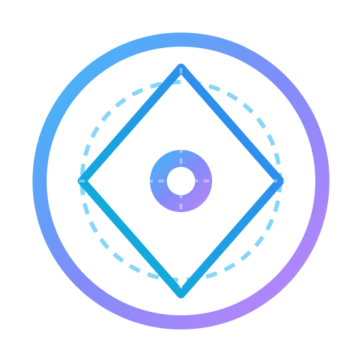

# Decision Lens (`decision-lens`)

<p align="center">
  
</p>

> **Host-Agnostic Deep Domain Research & Decision Support Protocol**  
> Features **MetaScout autonomous tool discovery**, permission auditing, isolated sandbox deployment, automatic rollback, zero-hallucination URL citations [[1]](url), 10 Core Factors deep dive, **`uv` portable execution**, and integrated generation of **Excel spreadsheets (.xlsx)**, **Interactive HTML Web Reports (.html)**, and **Editable PowerPoint Presentations (.pptx)**.

[](LICENSE)
[](https://github.com/Simple53/decision-lens/releases/tag/v1.4.0)
[](#-host-compatibility-matrix)
[中文说明文档](zh/README.md)

---

## 🌟 Core Features

- **MetaScout Dynamic Tool Orchestration**: Capability Audit, Approval Audit, Isolated Sandbox Deployment via `uv`, Dynamic Rollback, and Tool Retention Housekeeping.
- **Multi-Format Report Deliverables**: Auto-builds responsive dark-mode **Interactive HTML Reports (.html)**, native **Editable PowerPoint Presentations (.pptx)** via `python-pptx`, and **Excel spreadsheets (.xlsx)**.
- **100% Portable Execution via `uv`**: Uses `uv` for execution (`uv run python scripts/generate_report.py`), eliminating global environment pollution and manual setups.
- **Zero-Hallucination Web Protocol**: Mandates web search tool calls to verify every single URL with functional clickable links `[[1]](URL)`.
- **Strict No-Ranking Decision Support**: Completely removes Total Scores and 1-N rankings, replacing biased recommendations with objective Trade-off Analysis.

---

## 🔌 Host Compatibility Matrix

Decision Lens uses a Host-Agnostic Protocol, seamlessly running across major AI Agent platforms:

| AI Agent Platform | Configuration / Registration | User Approval Interface | Sandbox Execution Capability |
|---|---|---|---|
| **Codex** (OpenAI) | `.codex/skills/decision-lens` | CLI Confirmation Prompt | Sandbox Execution |
| **Claude Code** | `.claude/skills/decision-lens` | Interactive Terminal Dialog | Isolated Process |
| **OpenCode** | `opencode.json` / Skills | Host Question Modal | Isolated Venv / Subagent |
| **Grok Build** | `grok.config.json` | Approval Prompt | Worker Subagent |
| **Antigravity / AGY** | `~/.gemini/config/skills.json` | `ask_question` Tool | `invoke_subagent` (self) |

---

## 📂 Repository Structure

```text
decision-lens/
├── assets/
│   └── logo.svg             # Transparent vector logo
├── SKILL.md                 # Host-agnostic English Agent protocol (V1.4.0)
├── README.md                # English documentation
├── plugin.json              # Universal Plugin metadata manifest
├── pyproject.toml           # Portable uv configuration
├── requirements.txt         # Dependency manifest
├── scripts/
│   └── generate_report.py   # Multi-format report export script (Excel, HTML, PPTX)
├── resources/
│   └── report_template.md   # Standardized report Artifact template
└── zh/                      # Chinese documentation & resources
    ├── README.md            # Chinese documentation (V1.4.0)
    ├── SKILL.md            # Chinese protocol specification (V1.4.0)
    └── resources/
        └── report_template.md
```

---

## 🚀 Quick Start & Usage

### 1. Register Skill Path
Register the repository path in your AI Agent system configuration (`~/.gemini/config/skills.json`):

```json
{
  "entries": [
    { "path": "path/to/decision-lens" }
  ]
}
```

### 2. Portable Report Generation Test
Run the multi-format generation script via `uv` without manual dependency installation:

```bash
uv run python scripts/generate_report.py --output-dir ./output
```

Generates:
- `domain_research_candidates.xlsx` (Excel candidate pool)
- `domain_research_report.html` (Interactive HTML report)
- `domain_research_presentation.pptx` (Editable PowerPoint presentation)
