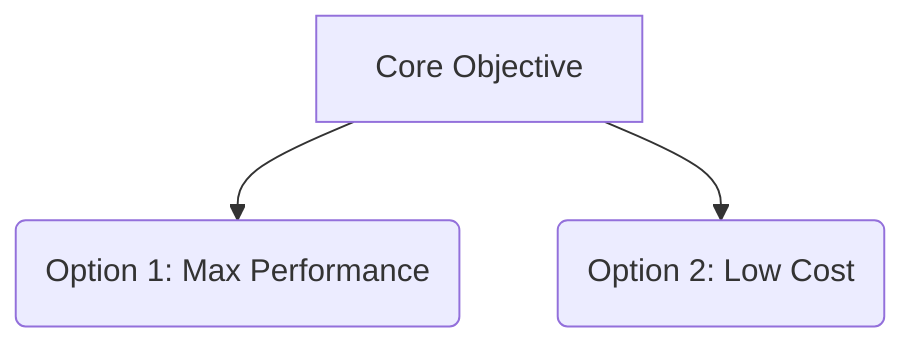

# Domain Research Report: [Topic Name]

> [!NOTE]
> This document is a decision-support research report generated by AI and updated dynamically as research progresses.

## 1. Domain Cognitive Map

### One-Sentence Definition
[Define the domain and its core problem space]

### Core Tension Model
[Primary trade-offs, e.g., Performance vs. Cost]

### Key Variables vs. Marketing Noise
- **Key Variables**: [Core factors that directly determine success]
- **Marketing Noise**: [Overhyped features with minimal real-world impact]

## 2. Option Comparison Matrix

| Factor | Option A | Option B |
|--------|----------|----------|
| Overview | ... | ... |
| Core Advantage | ... | ... |
| Critical Flaw | [Based on real-world cases] | [Based on real-world cases] |
| References | [Link](URL) | [Link](URL) |

## 3. Decision Assistance (Weighted Scoring)

> Note: Scores are qualitative estimates (1–5 scale) intended for relative ranking.

| Key Variable | Weight | Weight Origin | Option A | Option B |
|--------------|--------|---------------|----------|----------|
| Cost | 30% | User Preference | 4 | 2 |
| Reliability | 70% | Scenario Derived | 3 | 5 |
| **Weighted Score** | | | **3.3** | **4.1** |

## 4. Conditional Guidance
- If cost is the primary bottleneck → Option A.
- If reliability is mission-critical → Option B.

## 5. Evidence Index
- [5 Stars] [Official Documentation](URL) - 2024-01-01
- [4 Stars] [Independent Benchmark](URL) - 2024-05-12
