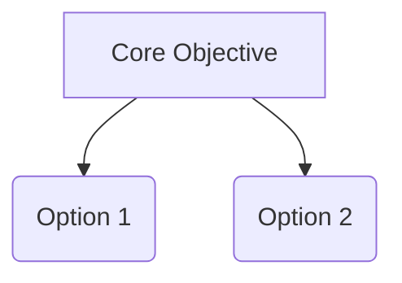

# Domain Research Report: [Topic Name]

> [!NOTE]
> This document is a decision-support research report generated by AI using the `decision-lens` framework.

## 1. Domain Scope & Filtering Parameters

### 1.1 Hard Constraints (Must-Have Criteria)
- **Criterion 1**: [Description of mandatory requirement]
- **Criterion 2**: [Description of mandatory requirement]

### 1.2 Initial Candidate Pool & Hard Screening
Total Candidates Scanned: [N] (via GitHub Topics & Awesome Lists [^1])

| Candidate | Status | Reason / Notes |
|-----------|--------|----------------|
| Candidate A | **PASSED** | Meets all Hard Constraints [^2] |
| Candidate B | **ELIMINATED** | Fails Criterion 1 [^3] |

---

## 2. Domain Cognitive Map

### 2.1 One-Sentence Definition
[Define the domain and its core problem space] [^4]

### 2.2 Core Tension Model
[Primary trade-offs, e.g., Performance vs. Cost] [^5]

---

## 3. Deep-Dive Candidate Specifications

### Option A Specification
- **Architecture**: ... [^6]
- **Custom/Free API Setup**: ... [^7]
- **Multi-Agent Mechanics**: ... [^8]

---

## 4. Option Matrix & Transparent Scoring

### 4.1 Option Comparison Matrix

| Factor | Option A | Option B |
|--------|----------|----------|
| Overview | ... [^9] | ... [^10] |
| Critical Flaw | ... [^11] | ... [^12] |

### 4.2 Transparent Weighted Scoring Matrix

| Key Variable | Weight | Weight Origin | Option A | Option B |
|--------------|--------|---------------|----------|----------|
| Cost | 30% | User Specified | 4 | 2 |
| Reliability | 70% | Scenario Derived | 3 | 5 |
| **Weighted Score** | | | **3.3** | **4.1** |

---

## 5. Decision Guidance & Action Plan
- If priority is X → Option A.
- If priority is Y → Option B.

---

## 6. References & Endnotes

- [^1]: [GitHub Topic / Source Name](URL) - Context description
- [^2]: [Official Project Docs](URL) - Context description
- [^3]: [Community Thread](URL) - Reason for elimination
- [^4]: [Academic / Spec Reference](URL) - Definition source
