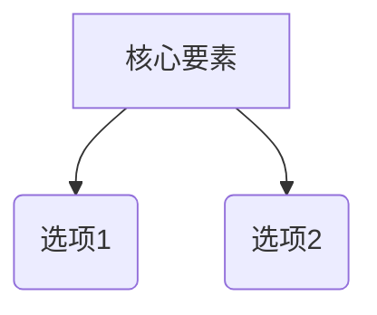

# 领域研究模板：[主题名称]

> [!NOTE]
> 本文档是决策支持研究报告的模板，由 AI 自动生成并随研究进度更新。

## 1. 认知地图

### 一句话定义
[填写领域定义]

### 核心张力模型
[核心矛盾，如性能 vs 成本]

### 关键变量与噪音
- **关键变量**：[真正影响结果的核心因素]
- **营销噪音**：[看起来重要但实际影响有限的指标]

## 2. 方案矩阵

| 维度 | 方案 A | 方案 B |
|------|--------|--------|
| 简述 | ... | ... |
| 核心优势 | ... | ... |
| 致命弱点 | [基于真实案例] | [基于真实案例] |
| 参考链接 | [链接](URL) | [链接](URL) |

## 3. 决策辅助 (加权评分)

**说明**：评分为定性估计（1-5），仅供排序参考。

| 关键变量 | 权重 | 权重来源 | 方案 A | 方案 B |
|----------|------|----------|--------|--------|
| 成本 | 30% | 用户要求 | 4 | 2 |
| 可靠性 | 70% | 场景推导 | 3 | 5 |
| **加权总分** | | | **3.3** | **4.1** |

## 4. 决策提示
- 如果看重成本 → 方案 A。
- 如果看重可靠性 → 方案 B。

## 5. 引用来源
- [5星] [官方文档](URL) - 2023-01-01
- [4星] [独立评测](URL) - 2023-05-12
