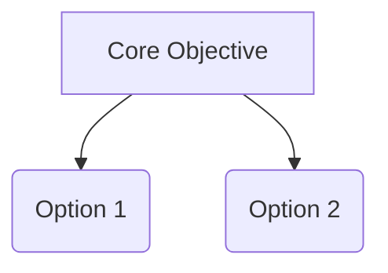

# Domain Research Report: [Topic Name]

## 1. Research Scope & Source Discovery

### 1.1 Hard Constraints (Must-Have Criteria)
- **Criterion 1**: [Description of mandatory requirement]
- **Criterion 2**: [Description of mandatory requirement]

### 1.2 Dynamically Discovered Search Sources (User Approved)
- **Source A**: [Reason for inclusion / Justification] [^1]
- **Source B**: [Reason for inclusion / Justification] [^2]

### 1.3 Unconstrained Candidate Discovery Pool (Full Scan Table)

| Candidate Name | Form Factor | Hard Constraint Status | Reason / Notes | Reference Link |
|----------------|-------------|------------------------|----------------|----------------|
| Project 1 | Desktop App | **PASSED** | Meets all Hard Constraints [^3] | [Source](https://valid-url.com) |
| Project 2 | VS Code Plugin | **ELIMINATED** | Fails Criterion 1 [^4] | [Source](https://valid-url.com) |
| Project 3 | CLI Tool | **ELIMINATED** | Fails Criterion 2 [^5] | [Source](https://valid-url.com) |
| ... | ... | ... | ... | ... |

*(Note: From the full candidate pool above, the Top 10–15 eligible projects have been selected for the main comparison matrix and deep-dive specifications below).*

---

## 2. Domain Cognitive Map

### 2.1 One-Sentence Definition
[Define the domain and its core problem space] [^6]

### 2.2 Core Tension Model
[Primary trade-offs, e.g., Performance vs. Cost] [^7]

---

## 3. Top 10–15 Candidate Deep-Dive Specifications (Extracted via `read_url_content`)

### Candidate 1 Specification
- **Architecture & Form Factor**: ... [^8]
- **Custom/Free API Setup (DeepSeek/SiliconFlow/Ollama)**: ... [^9]
- **Multi-Agent & Vision Mechanics**: ... [^10]

---

## 4. Top 10–15 Option Matrix & Transparent Scoring

### 4.1 Primary Comparison Matrix (Top 10–15 Eligible Candidates)

| Factor | Candidate 1 | Candidate 2 | ... | Candidate 10–15 |
|--------|-------------|-------------|-----|-----------------|
| Overview | ... [^11] | ... [^12] | ... | ... |
| Critical Flaw | ... [^13] | ... [^14] | ... | ... |

### 4.2 Transparent Weighted Scoring Matrix

| Key Variable | Weight | Weight Origin | Candidate 1 | Candidate 2 | ... | Candidate 10–15 |
|--------------|--------|---------------|-------------|-------------|-----|-----------------|
| Variable A | 30% | User Specified | 4 | 2 | ... | ... |
| Variable B | 70% | Scenario Derived | 3 | 5 | ... | ... |
| **Weighted Score** | | | **3.3** | **4.1** | ... | ... |

---

## 5. Decision Guidance & Action Plan
- If priority is X → Candidate 1.
- If priority is Y → Candidate 2.

---

## 6. References & Endnotes

[^1]: [Discovered Platform A](https://valid-url.com) - Source discovery justification
[^2]: [Discovered Platform B](https://valid-url.com) - Source discovery justification
[^3]: [Official Project Docs](https://valid-url.com) - Candidate verification
[^4]: [Academic / Benchmark Paper](https://valid-url.com) - Tension model proof
