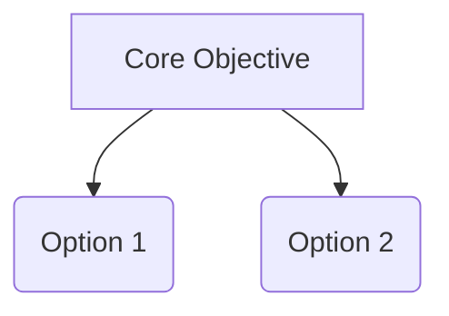

# Domain Research Report: [Topic Name]

## 1. Research Scope & Source Discovery

### 1.1 Hard Constraints (Must-Have Criteria)
- **Criterion 1**: [Description of mandatory requirement]
- **Criterion 2**: [Description of mandatory requirement]

### 1.2 Dynamically Discovered Search Sources (User Approved)
- **Source A**: [Reason for inclusion / Justification] [^1]
- **Source B**: [Reason for inclusion / Justification] [^2]

*(Note: Candidates failing Hard Constraints have been silently excluded from comparison tables).*

---

## 2. Domain Cognitive Map

### 2.1 One-Sentence Definition
[Define the domain and its core problem space] [^3]

### 2.2 Core Tension Model
[Primary trade-offs, e.g., Performance vs. Cost] [^4]

---

## 3. Deep-Dive Candidate Specifications

### Option A Specification
- **Architecture**: ... [^5]
- **Custom/Free API Setup**: ... [^6]
- **Multi-Agent Mechanics**: ... [^7]

---

## 4. Option Matrix & Transparent Scoring

### 4.1 Option Comparison Matrix (Passed Candidates Only)

| Factor | Option A | Option B |
|--------|----------|----------|
| Overview | ... [^8] | ... [^9] |
| Critical Flaw | ... [^10] | ... [^11] |

### 4.2 Transparent Weighted Scoring Matrix

| Key Variable | Weight | Weight Origin | Option A | Option B |
|--------------|--------|---------------|----------|----------|
| Cost | 30% | User Specified | 4 | 2 |
| Reliability | 70% | Scenario Derived | 3 | 5 |
| **Weighted Score** | | | **3.3** | **4.1** |

---

## 5. Decision Guidance & Action Plan
- If priority is X → Option A.
- If priority is Y → Option B.

---

## 6. References & Endnotes

[^1]: [Discovered Platform A](https://valid-url.com) - Source discovery justification
[^2]: [Discovered Platform B](https://valid-url.com) - Source discovery justification
[^3]: [Official Documentation](https://valid-url.com) - Core definition reference
[^4]: [Academic / Benchmark Paper](https://valid-url.com) - Tension model proof
