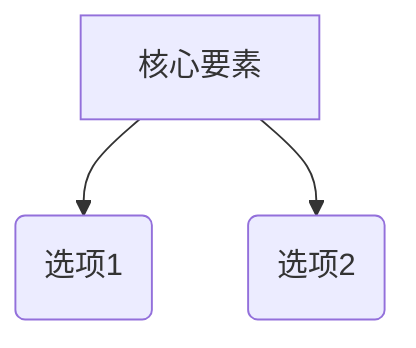

# 领域研究模板：[主题名称]

> [!NOTE]
> 本文档是由 AI 采用 `decision-lens` 框架生成的决策支持研究报告。正文中所有关键结论与项目特征均附带角标引用 `[^N]`，完整列表详见文末【参考文献与索引】。

## 1. 研究边界与动态信源探索

### 1.1 硬性条件 (Hard Constraints / 一票否决项)
- **硬性条件 1**：[必须满足的硬性指标描述]
- **硬性条件 2**：[必须满足的硬性指标描述]

### 1.2 动态探索发现的信源范围 (经用户裁决确认)
- **数据源 A**：[发现依据与包含理由] [^1]
- **数据源 B**：[发现依据与包含理由] [^2]

### 1.3 初始候选池广度扫描与初筛
扫描来源：GitHub Topics / Awesome 汇总列表 [^3]

| 候选项目 | 初筛状态 | 判定原因 / 依据 |
|----------|----------|-----------------|
| 候选项目 A | **通过初筛** | 满足所有硬性条件 [^4] |
| 候选项目 B | **一票否决剔除** | 不满足硬性条件 1 [^5] |

---

## 2. 领域认知地图

### 2.1 一句话定义
[领域定义描述] [^6]

### 2.2 核心张力模型
[核心矛盾，如性能 vs 成本] [^7]

---

## 3. 核心方案深度技术卡片

### 方案 A 深度剖析
- **架构与形态**：... [^8]
- **自定义/免费 API 配置指引**：... [^9]
- **多智能体/多模式协同机制**：... [^10]

---

## 4. 方案对比矩阵与加权评分

### 4.1 方案维度对比矩阵

| 维度 | 方案 A | 方案 B |
|------|--------|--------|
| 简述 | ... [^11] | ... [^12] |
| 致命弱点 | ... [^13] | ... [^14] |

### 4.2 透明加权评分表

| 关键变量 | 权重 | 权重来源 | 方案 A | 方案 B |
|----------|------|----------|--------|--------|
| 成本 | 30% | 用户明确要求 | 4 | 2 |
| 可靠性 | 70% | 场景推导 | 3 | 5 |
| **加权总分** | | | **3.3** | **4.1** |

---

## 5. 决策提示与动作建议
- 如果最看重 X → 方案 A。
- 如果最看重 Y → 方案 B。

---

## 6. 参考文献与索引 (References)

- [^1]: [动态探索发现数据源 A](URL) - 探索依据
- [^2]: [动态探索发现数据源 B](URL) - 探索依据
- [^3]: [GitHub Topic / 汇总链接](URL) - 检索来源说明
- [^4]: [官方项目文档](URL) - 验证依据
