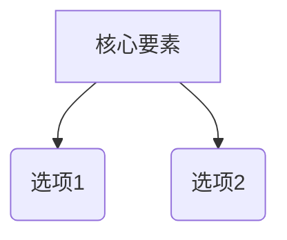

# 领域研究模板：[主题名称]

## 1. 研究边界与动态信源探索

### 1.1 硬性条件 (Hard Constraints / 一票否决项)
- **硬性条件 1**：[必须满足的硬性指标描述]
- **硬性条件 2**：[必须满足的硬性指标描述]

### 1.2 动态探索发现的信源范围 (经用户裁决确认)
- **数据源 A**：[发现依据与包含理由] [^1]
- **数据源 B**：[发现依据与包含理由] [^2]

### 1.3 不限数量候选池扫荡全量表 (Excel 格式化大表)

| 项目名称 | 软件形态 | 硬性条件判定 | 剔除/入选原因 | 来源参考链接 |
|----------|----------|--------------|---------------|--------------|
| 项目 1 | 独立桌面 App | **通过初筛** | 满足所有硬性条件 [^3] | [来源](https://valid-url.com) |
| 项目 2 | VS Code 插件 | **一票否决** | 不满足硬性条件 1 [^4] | [来源](https://valid-url.com) |
| 项目 3 | 纯 CLI 命令 | **一票否决** | 不满足硬性条件 2 [^5] | [来源](https://valid-url.com) |
| ... | ... | ... | ... | ... |

*(注：从上述全量候选池中，筛选出符合条件的 Top 10–15 个核心方案展开至下方的维度对比矩阵与深度剖析中)*。

---

## 2. 领域认知地图

### 2.1 一句话定义
[领域定义描述] [^6]

### 2.2 核心张力模型
[核心矛盾，如性能 vs 成本] [^7]

---

## 3. Top 10–15 核心方案深度技术卡片 (`read_url_content` 真实读取)

### 方案 1 深度剖析
- **架构与形态**：... [^8]
- **自定义/免费 API 配置指引**：... [^9]
- **多智能体/多模态协同机制**：... [^10]

---

## 4. Top 10–15 方案对比矩阵与加权评分

### 4.1 主维度对比矩阵 (保留 10–15 个核心方案)

| 维度 | 方案 1 | 方案 2 | ... | 方案 10–15 |
|------|--------|--------|-----|------------|
| 简述 | ... [^11] | ... [^12] | ... | ... |
| 致命弱点 | ... [^13] | ... [^14] | ... | ... |

### 4.2 透明加权评分表

| 关键变量 | 权重 | 权重来源 | 方案 1 | 方案 2 | ... | 方案 10–15 |
|----------|------|----------|--------|--------|-----|------------|
| 成本 | 30% | 用户明确要求 | 4 | 2 | ... | ... |
| 可靠性 | 70% | 场景推导 | 3 | 5 | ... | ... |
| **加权总分** | | | **3.3** | **4.1** | ... | ... |

---

## 5. 决策提示与动作建议
- 如果最看重 X → 方案 1。
- 如果最看重 Y → 方案 2。

---

## 6. 参考文献与索引 (References)

[^1]: [动态探索发现数据源 A](https://valid-url.com) - 探索依据与上下文
[^2]: [动态探索发现数据源 B](https://valid-url.com) - 探索依据与上下文
[^3]: [官方项目文档](https://valid-url.com) - 核心定义出处
[^4]: [学术与基准评测论文](https://valid-url.com) - 张力模型证据
