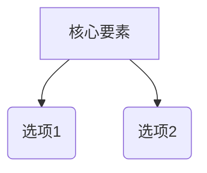

# 领域研究模板：[主题名称]

## 1. 研究边界与动态信源探索

### 1.1 硬性条件 (Hard Constraints / 一票否决项)
- **硬性条件 1**：[必须满足的硬性指标描述]
- **硬性条件 2**：[必须满足的硬性指标描述]

### 1.2 动态探索发现的信源范围 (经用户裁决确认)
- **数据源 A**：[发现依据与包含理由] [^1]
- **数据源 B**：[发现依据与包含理由] [^2]

*(注：不满足硬性条件的候选项目已在初筛阶段静默剔除，不进入主对比矩阵表格)*。

---

## 2. 领域认知地图

### 2.1 一句话定义
[领域定义描述] [^3]

### 2.2 核心张力模型
[核心矛盾，如性能 vs 成本] [^4]

---

## 3. 核心方案深度技术卡片

### 方案 A 深度剖析
- **架构与形态**：... [^5]
- **自定义/免费 API 配置指引**：... [^6]
- **多智能体/多模式协同机制**：... [^7]

---

## 4. 方案对比矩阵与加权评分

### 4.1 方案维度对比矩阵 (仅包含通过初筛的候选项目)

| 维度 | 方案 A | 方案 B |
|------|--------|--------|
| 简述 | ... [^8] | ... [^9] |
| 致命弱点 | ... [^10] | ... [^11] |

### 4.2 透明加权评分表

| 关键变量 | 权重 | 权重来源 | 方案 A | 方案 B |
|----------|------|----------|--------|--------|
| 成本 | 30% | 用户明确要求 | 4 | 2 |
| 可靠性 | 70% | 场景推导 | 3 | 5 |
| **加权总分** | | | **3.3** | **4.1** |

---

## 5. 决策提示与动作建议
- 如果最看重 X → 方案 A。
- 如果最看重 Y → 方案 B。

---

## 6. 参考文献与索引 (References)

[^1]: [动态探索发现数据源 A](https://valid-url.com) - 探索依据与上下文
[^2]: [动态探索发现数据源 B](https://valid-url.com) - 探索依据与上下文
[^3]: [官方项目文档](https://valid-url.com) - 核心定义出处
[^4]: [学术与基准评测论文](https://valid-url.com) - 张力模型证据
